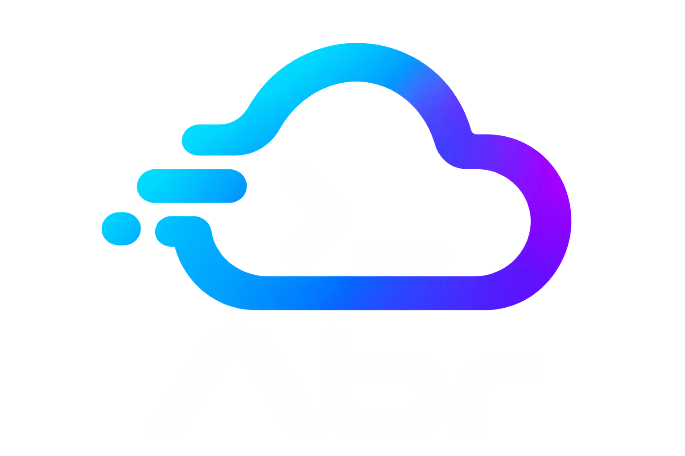

# Abr

**Abr (ابر)** means cloud in Persian. A Go CLI and interactive menu for a clean
**Ubuntu 26.04 LTS AMD64** VPS.
Laravel uses PHP-FPM or shared RoadRunner/Octane; Nuxt uses Node for SSR or SPA.
Caddy serves direct HTTPS. Users, databases, services and ports are managed per app.
Version remains **0.1.0** during stabilization; development supports macOS ARM64.

## Start with a fresh VPS

1. Allow your SSH port, TCP 80/443 and UDP 443 in your provider firewall, and point
   your app's DNS at the VPS.

2. On your computer (macOS/Linux shell), replace the placeholders and install
   your SSH public key for your existing root/sudo account. If you need a key,
   first run `ssh-keygen -t ed25519`.

   ```sh
   VPS_HOST=YOUR_VPS_IP
   VPS_USER=YOUR_SSH_USER
   VPS_PORT=22
   cat ~/.ssh/id_ed25519.pub | ssh -p "$VPS_PORT" "$VPS_USER@$VPS_HOST" \
     'umask 077; mkdir -p ~/.ssh; cat >> ~/.ssh/authorized_keys'
   ssh -p "$VPS_PORT" -o PasswordAuthentication=no \
     -o KbdInteractiveAuthentication=no "$VPS_USER@$VPS_HOST"
   ```

   **Test key login in a second terminal and keep that session open during setup.**
   Setup requires working key access and disables password login.

3. On the VPS, update Ubuntu. If `/var/run/reboot-required` exists, run
   `sudo reboot`, then reconnect before continuing.

   ```sh
   sudo apt-get update
   sudo apt-get full-upgrade -y
   ```

4. Download `abr-linux-amd64` and `abr-linux-amd64.sha256` from **Releases** once
   a binary release is available. Alternatively, download the **abr-linux-amd64**
   artifact from a successful main-branch run under **Actions → Check and package**
   and extract GitHub's artifact ZIP. Upload the two files from your computer
   using the variables from step 2. The original v0.1.0 release predates host
   management.

   ```sh
   scp -P "$VPS_PORT" abr-linux-amd64 abr-linux-amd64.sha256 \
     "$VPS_USER@$VPS_HOST:"
   ```

5. On the VPS, verify and install the binary, then run setup:

   ```sh
   cd ~
   sha256sum -c abr-linux-amd64.sha256
   sudo install -m 755 abr-linux-amd64 /usr/local/bin/abr
   abr setup --dry-run --admin-user "$(id -un)"
   sudo abr setup --admin-user "$(id -un)"
   sudo abr
   ```

Only the binary is needed on the VPS; templates and the generic example config are
embedded. Setup installs PHP 8.5/extensions (including Imagick SVG support and
Excimer), Node 24, latest compatible npm, npm-check-updates, Caddy, Composer,
shared RoadRunner, MySQL 8.4, Redis and image optimization tools. It configures
key-only SSH, local databases, UFW, Fail2ban and
security updates. Root key login remains allowed. Use `--admin-user USER` when the
SSH account differs from the sudo user; `--ssh-port PORT` preserves an additional
port. `--no-firewall`, `--no-redis`, `--no-images` skip those features. Setup neither
attaches Ubuntu Pro nor reboots; failed setup can leave package changes in place.

## Deploy apps

For private repositories, use one GitHub account SSH key for the VPS:

```sh
sudo abr git setup
# Add the printed public key to GitHub account Settings → SSH and GPG keys.
sudo abr clone git@github.com:OWNER/PROJECT.git /srv/apps/api
sudo abr register --name api --dir /srv/apps/api --type laravel \
  --domain api.example.com --web-driver octane \
  --queue-workers 2 --scheduler
sudo install -m 600 /srv/apps/api/.env.example /srv/apps/api/.env
sudo abr database api --show
sudoedit /srv/apps/api/.env
sudo abr deploy api --no-pull
sudo abr status api
```

Copy the displayed database credentials into `.env` and set your app secrets.
Later, `sudo abr deploy api` pulls with `git pull --ff-only`. Apps share the GitHub
key's permissions; private Composer/npm dependencies may need separate credentials.
Use `git setup --key /absolute/private-key` to import an existing unencrypted key.

Laravel deployment runs **npm ci → npm run build → Composer install → migrations →
optimization → services**. It generates a missing APP_KEY and storage link. FPM is
the default driver. Optional flags: `--scheduler`, `--queue-workers N`, `--nightwatch`,
`--inertia-ssr`, `--octane-workers N`, `--health-check URL`; `--no-database` keeps DB
management external. Install the corresponding Laravel packages in your project;
Inertia's server bundle must honor `SSR_PORT`. Octane uses the shared RoadRunner;
remove any app-local `rr` binary. Deployments have downtime and no automatic rollback.

```sh
sudo abr clone git@github.com:OWNER/WEB.git /srv/apps/web
sudo abr register --name web --dir /srv/apps/web --type nuxt --domain example.com
# Prepare .env if needed; commit package-lock.json (and composer.lock for Laravel).
sudo abr deploy web --no-pull
sudo abr restart api web
sudo abr logs api queue@1
sudo abr ports
sudo abr disable api
sudo abr enable api
```

`--alias DOMAIN` redirects to the main domain; `--serving-domain DOMAIN` serves the
same app. Both are repeatable. Independent subdomain apps are supported; wildcards
are not. Edit `/etc/abr/config.toml` to change settings, then run `abr ports
--allocate` and `abr enable APP`. `abr remove APP` removes managed services/user
and reservations while preserving the project, secrets, home and database.

### Canonical host per app

The registration menu offers **As entered**, **Prefer www**, and **Prefer non-www**.
The CLI supports the same choice for Laravel and Nuxt:

```sh
sudo abr register --name website --dir /srv/apps/website --type laravel \
  --domain example.com --canonical-host www
```

`www` serves `www.example.com` and redirects `example.com` to it. `non-www` serves
`example.com` and redirects `www.example.com` to it. Both accept either spelling
in `--domain`. The default, `as-entered`, serves exactly the entered hostname and
adds no www alias. A separate app at `api.example.com` keeps its own hostname;
choices apply only to the selected app's exact www/non-www pair.

The resulting canonical hostname is saved as `domain` and the other hostname as
an `aliases` entry. Other redirect aliases and additional serving domains keep
their existing roles. A conflicting `--serving-domain` for the selected pair is
rejected. Point both hostnames' DNS at the VPS; set Laravel's `APP_URL` to the
canonical HTTPS URL. Redirects use **308**, preserving method, path and query.

For an existing app, edit its `domain` and `aliases` in `/etc/abr/config.toml`, then
run `sudo abr config validate` and `sudo abr enable APP`. Upgrades preserve edited
templates: on an existing VPS, change both `permanent` redirects in
`/etc/abr/templates/caddy-site.caddy.tmpl` to `308` before enabling the app if its
installed template still uses the old status code.

## Database backups and imports

Database backups and imports are available in the menu and CLI:

```sh
sudo abr database backup api --output-dir /var/lib/abr/backups
sudo abr database backup api portal --output-dir /var/lib/abr/backups
sudo abr database backup --all --output-dir /var/lib/abr/backups
sudo abr disable api
sudo abr database import api /absolute/backup.sql --yes
sudo abr enable api
```

Selections are registered app names; `--all` includes every registered managed
DB, excluding MySQL system databases and external DBs. Each dump is a separate,
root-only SQL file in a new/private root-owned directory (0700). Backups stream
with an InnoDB consistent snapshot and include routines, triggers and events;
avoid schema changes during export. Nontransactional tables and multiple DBs are
not one consistent snapshot. Copy backups off the VPS. Imports use the app's scoped
account, disable client shell/file commands, and can overwrite data. Stop all
writers first. Failure may leave partial changes; import does not clear extra
existing tables or restart services. Dumps with foreign DEFINERs may need review.

## Templates and runtime settings

Runtime templates stay editable under `/etc/abr/templates`; setup copies missing
files from the binary and preserves existing templates. Compare your edits with
the [source templates](templates/) when upgrading; existing files are never
automatically replaced by new defaults.
`--templates-dir` selects another installed template directory. Shared settings
apply on `abr setup`; app templates on `abr enable APP` or `abr deploy APP`.
Templates are trusted root configuration; validate edits on a disposable Ubuntu
host. App templates use Go text/template with validated values and escaped paths.
Generated files carry ownership markers. Caddy/FPM configurations are validated
before reload and restored on ordinary configuration failures. Shared
SSH/MySQL/Redis/PHP/update templates are copied as native configuration.

Nuxt uses one service regardless of SSR settings and loads `.env` with Node's
`--env-file-if-exists`; Laravel reads `.env` itself. Inertia's bundle must honor
`SSR_PORT`, and Laravel receives `INERTIA_SSR_URL`. Nightwatch receives its ingest
endpoint. Octane finds shared RoadRunner through PATH. Queue timeout/shutdown
grace are 60s/120s; customize these and other limits in the templates.

Defaults suit a modest shared host: MySQL 256 MiB buffer pool/100 connections,
Redis 256 MiB with **no eviction** and AOF every second, FPM five ondemand children
per app/recycling every 500 requests, shared OPcache 128 MiB. Measure RAM/workload
and adjust these limits; Redis rejects writes at its limit and crashes can lose
about one second of writes. PHP error display/version headers are disabled.

Caddy strips Server/X-Powered-By headers, compresses dynamic responses with
[zstd/gzip](https://caddyserver.com/docs/caddyfile/directives/encode), and serves
[precompressed Brotli](https://caddyserver.com/docs/caddyfile/directives/file_server)
for built assets generated during deploy. Versioned Vite/Nuxt assets get immutable
browser caching; HTML/API/SSR responses keep the application's cache policy.
The packaged welcome page is replaced with a generic 404. Identifying text in
application bodies must be removed in the application itself.

## Development

Source templates stay in `templates/`; Go embeds them and `config.example.toml`
when building the executable. Rebuild to bundle changes to these defaults.

From the repository root on macOS/Linux, use temporary paths and `--config-only`:

```sh
task_dir=$(mktemp -d)
go run ./cmd/abr register --config "$task_dir/config.toml" \
  --state-dir "$task_dir/state" --config-only --name demo \
  --dir /srv/apps/demo --type laravel --domain demo.example.com
go run ./cmd/abr list --config "$task_dir/config.toml"
go run ./cmd/abr --config "$task_dir/config.toml" --state-dir "$task_dir/state" \
  --templates-dir ./templates deploy demo --dry-run
go vet ./...
go test ./...
CGO_ENABLED=0 GOOS=linux GOARCH=amd64 go build -o /tmp/abr-linux-amd64 ./cmd/abr
```

[config.example.toml](config.example.toml) documents the configuration;
`abr config example` prints the embedded copy without changing live settings.
`abr help` lists commands; `abr doctor` checks portable config/registry/port availability.
CI checks formatting/vet/tests, builds the standalone binary and checksum, and
runs actual setup/deployment/backup/restore tests on a disposable Ubuntu host
from an isolated binary. Pushing a `v*` tag publishes those two assets to GitHub
Releases only after both CI jobs pass. GitHub also includes its standard source
archives.
`scripts/host-smoke.sh` changes an entire host: never run it on production.
